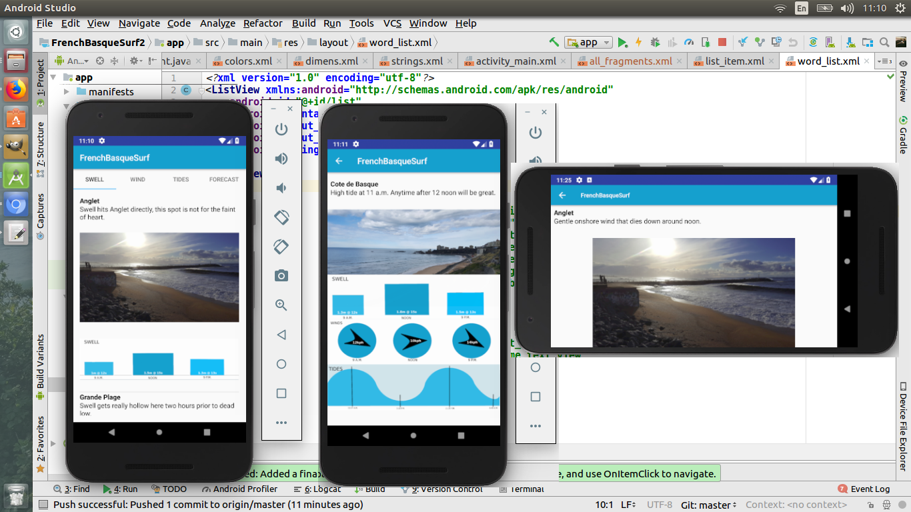

# FrenchBasqueSurf
Part 4, Project 2 from Udacity's Android Basics Nanodegree by Google is the Tour Guide App.
The goal is to create a Tour Guide App which represents relevant information to a user who's
visiting your city. The app can list top attractions, restaurants, public places, or events for the city.
The specifications were as follows: 
 - App contains at least 4 lists of relevant attractions for a location
 - User navigates between lists in Fragments using either a Navigation Drawer or ViewPager plus Tab Layout
 - Each list item contains information about an event, restaurant, historical site or similar
 - At least one list includes pictures of the location
 
 As you will see by my App; I differed from the norm and created a Tour Guide App for Surfers that visit my region.
 Additionally, i took the app a step further by implementing a final activity that houses each Tab for a specific location
 into one page that groups all of the relevant information for one location in one activity.
 
 
